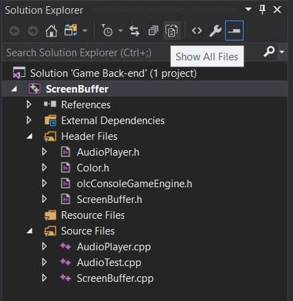

# Bound-Console-Game
Group console game

# Hướng dẫn cách làm việc với Git trên Visual Studio
Để giữ cho repo chứa đồ án gọn gàng. Ta thống nhất hạn chế add các file không liên quan đến đồ án vào git (vd như các file project của Visual Studio). Cách dễ dàng nhất để làm việc này là mở Visual Studio và **tạo sẵn một Solution và Project mới**. Sau đó truy cập tới tệp **<Tên Solution>\\<Tên Project>** và sử dụng lệnh **git clone** để tạo một thư mục **Bound-Console-Game** tại đó.

Visual Studio tạo một hệ thống lọc để không hiển thị hết các file trong _Solution Explorer_ vì vậy bạn sẽ không thể thấy các file trong **Bound-Console-Game** hay folder đó.Tuy nhiên chúng ta có thể yêu cầu hiển thị bằng cách chọn **Show all files** phía trên.

Bạn sẽ thấy những file được lọc ra có màu tối hơn và có dấu đỏ bên dưới
Sau đó để có thể bắt đầu làm việc với file đó trong Visual Studio. **Nhấn chuột phải** và chọn **Include In Project**. Cuối cùng, nhấn **Show all files** một lần nữa để quay lại như cũ. 

Đôi khi chúng ta cần ẩn vài file khỏi Visual Studio (có thể ta muốn tạo một hàm main mới để test chức năng gì đó). **Nhấn chuột phải** và file cần ẩn chọn **Remove** -> **Remove**. Visual Studio lúc này sẽ không compile file đó nữa và file đó cũng không bị xóa, bạn có thể add vào bằng cách ở trên.
# Hướng dẫn cài đặt thư viện SDL và SDL_mixer trong Visual Studio
Vì module Audio của game sẽ sử dụng thư viện SDL và SDL_mixer nên cần có một số cài đặt để module này có thể được sử dụng
1. Tải về thư viện SDL và SDL_mixer tại: 
* **Souce**: 
  * SDL: https://www.libsdl.org/download-2.0.php  
  * SDL_mixer: https://www.libsdl.org/projects/SDL_mixer/

Nên nhớ phiên bản download về là **Development Libraries**, nên tránh nhầm lẫn với phiên bản **Source code** hay **Runtime Binaries**.

1. Giải nén và đặt chúng ở nơi bạn có thể dễ truy cập tới sau này.

1. Mở Visual Studio. Nhấn vào **Project** -> **<Tên Project>'s Properties** -> **C/C++** -> **General** -> **Ađitional Include Directories (bên tay phải)** -> **Edit** và chọn đường dẫn tới tệp **Include** của 2 thư viện mà bạn đã giải nén.

1. Vẫn trong cửa sổ đó, chọn thẻ **Linker (bên tay trái)** -> **Additional Library Directories** cũng chọn đường dẫn tới 2 thư viện như trên nhưng lần này thay vì tới tệp Include ta dẫn tới tệp **lib/x86**.

1. Mở rộng thẻ **Linker** -> **Input** -> **Additional Dependencies** và nhập vào 3 dòng **SDL2.lib**, **SDL2main.lib**, **SDL2_mixer.lib**. 

1. Nhấn **OK** để lưu tại tất cả thay đổi.

1. Bây giờ chỉ cần copy 2 file **SDL2.dll** và **SDL2_mixer.dll** vào tệp có chứa các file đuôi **.vcxproj** là xong.
